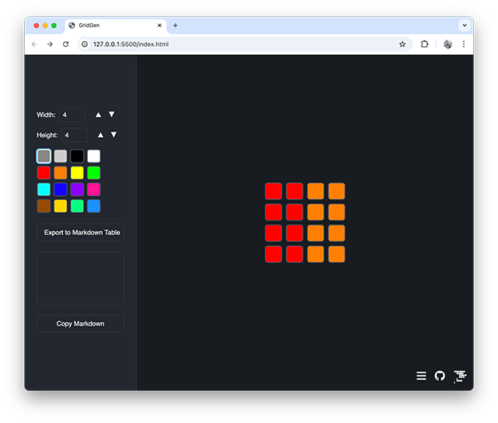

# GridGen

A basic web page uased to generate Markdown tables of a grid of colours. This is used to generate grids for the [Decode an Iage](https://challenges.codeadam.ca/decode-an-image) coding challenge. This quick tool was coded using [GitHub Copilot]([https://pages.codeadam.ca/gridgen/](https://github.com/features/copilot)).

> GridGen is available to view at:  
> https://pages.codeadam.ca/gridgen/

---

## Project Stack

This project uses vanillia [HTML](https://www.w3.org/html/), [CSS](https://www.w3.org/Style/CSS/Overview.en.html), and [JavaScript](https://developer.mozilla.org/en-US/docs/Web/JavaScript).

  

---

## Repo Resources

* [GridGen](https://pages.codeadam.ca/gridgen/)
* [GitHub Copilot](https://pages.codeadam.ca/gridgen/)

 

